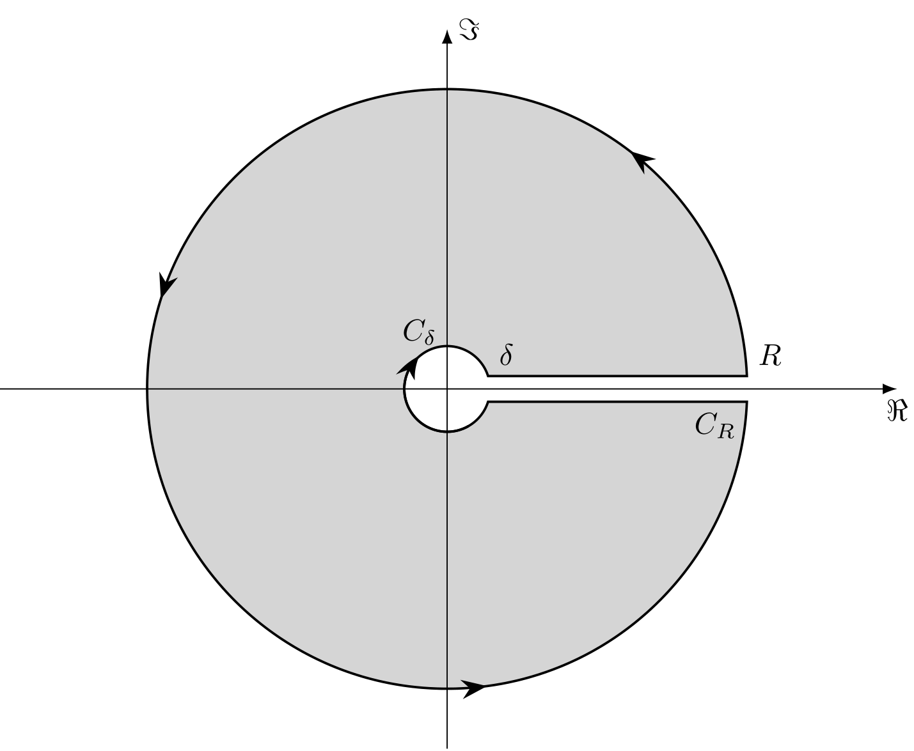

定义：

$$ \Gamma(z) = \int _0^\infty t^{z-1} e^{-t} \mathrm dt
$$

$$ \mathrm B(p, q) = \int _0^1 t^{p-1} (1-t)^{q-1} \mathrm dt
$$

性质：

1. $\Gamma(z + 1) = z \Gamma(z)$
2. $\mathrm B(p, q) = \mathrm B(q, p)$
3. $\mathrm B(p + 1, q) = \dfrac{p}{p + q}\mathrm B(q, p)$
4. $\mathrm B(p, q) = \dfrac{\Gamma(p)\Gamma(q)}{\Gamma(p + q)}$
证明[^1]：
令 $t = \dfrac{x}{1 + x}$，有
$$ \mathrm B(p, q) = \int _0^\infty \dfrac{x^{p-1}}{(1+x)^{p+q}} \mathrm d x
$$
于是，
$$ \begin{align*}
    \mathrm B(p, q)\Gamma(p+q)
    &= \int _0^\infty x^{p+q-1}\mathrm e^{-x}\mathrm dx
    \int _0^\infty \dfrac{y^{q-1}\mathrm dy}{(1+y)^{p+q}} \\
    &= \int _0^\infty \mathrm dy \int _0^\infty
    x^{p+q-1}\mathrm e^{-x} \dfrac{y^{q-1}}{(1+y)^{p+q}} \mathrm dx
\end{align*}
$$
令 $x = (1+y)u$，
$$ \begin{align*}
    上式 &= \int _0^\infty \mathrm dy \int _0^\infty
    u^{p+q-1}\mathrm e^{-u-uy} y^{q-1} \mathrm du \\
    &= \int _0^\infty \mathrm du \int _0^\infty
    u^{p+q-1}\mathrm e^{-u-uy} y^{q-1} \mathrm dy
\end{align*}
$$
再令 $uy = t$，
$$ \begin{align*}
    上式 = \int _0^\infty u^{p-1} e^{-u} \mathrm du
    \int _0^\infty t^{q-1} \mathrm e^{-u} \mathrm dt
    = \Gamma(p)\Gamma(q)
\end{align*}
$$
证毕！

5. $\mathrm B(\alpha, 1-\alpha) = \Gamma(\alpha)\Gamma(1-\alpha) = \dfrac{\pi}{\sin \alpha\pi}$(余元公式)
证明[^2]：
由上述证明，
$$ \mathrm B(\alpha, 1-\alpha) = \int _0^\infty \dfrac{\mathrm d x}{x^\alpha (1+x)}
$$
令 $f(z) = \dfrac{1}{z^\alpha (1+z)}$，取锁孔形积分围道 $C$(如图所示，$0 < \delta < 1$)，由留数定理有
$$ \begin{align*}
    \oint _C \dfrac{\mathrm d z}{z^\alpha (1+z)}
    &= 2\pi i\mathrm{Res}(f, -1)
    = 2\pi i\mathrm e ^{-i\pi\alpha} \\
    &= \oint _{C_R} \dfrac{\mathrm d z}{z^\alpha (1+z)} 
    -\oint _{C_\delta} \dfrac{\mathrm d z}{z^\alpha (1+z)} 
    +\int _\delta^R \dfrac{\mathrm d x}{x^\alpha (1+x)} 
    +\int _R^\delta \dfrac{\mathrm e ^{-2\pi \alpha i}\mathrm d x}{x^\alpha (1+x)} \\
    &\to (1 - \mathrm e ^{-2\pi \alpha i})\mathrm B(\alpha, 1-\alpha)
\end{align*}
$$
因此
$$ \mathrm B(\alpha, 1-\alpha) = 
\dfrac{2\pi i\mathrm e ^{-i\pi\alpha}}{1 - \mathrm e ^{-2\pi \alpha i}} = \dfrac{\pi}{\sin \alpha \pi}
$$

## 参考

[^1]:[Euler积分—B函数与Γ函数](https://zhuanlan.zhihu.com/p/433589729)
[^2]:[余元公式的三种证法及几个简单应用](https://zhuanlan.zhihu.com/p/336909698)