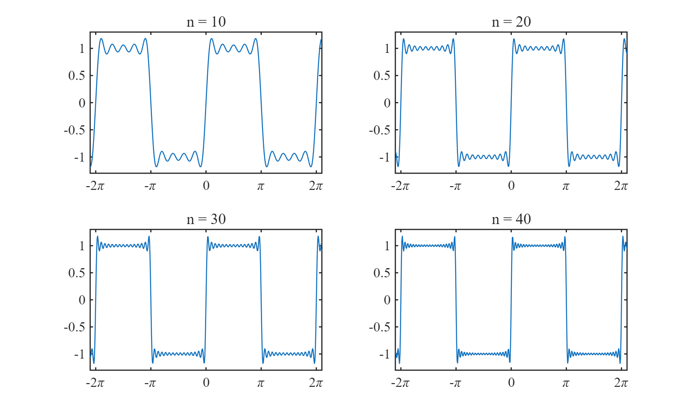

$\textbf{定义 1.}$ 函数列 $\{f_n(x)\}$ 一致收敛于 $f(x)$，若 $\forall \varepsilon > 0, \exists N > 0$，使得当 $n > N$ 时，$|f_n(x) - f(x)| < \varepsilon$.

$\textbf{定义 2.}$ 函数列 $\{f_n(x)\}$ 逐点收敛于 $f(x)$，若 $\forall \varepsilon > 0, \exists N(x) > 0$，使得当 $n > N$ 时，$|f_n(x) - f(x)| < \varepsilon$.

回顾定义，这两种收敛的区别仅在 $N$，定义 $1$ 中 $N$ 和 $x$ 无关，而后者中则可能有关.

我们以这个函数的傅里叶展开为例.
$$\begin{align*}
    f(x) &= 
    \begin{cases}
        1 & \text{if } 0 < x \le \pi \\
        0  & \text{if } x = 0 \\ 
        -1 & \text{if } -\pi \le x < 0 \\
    \end{cases} \\
    &= \dfrac{2}{\pi} \sum_{n \ge 1} \dfrac{1 - (-1)^n}{n} \sin nx
\end{align*}$$

如下图所示，这是展开项数为 $10, 20, 30, 40$ 时的情况.

我们可以看到，虽然随着 $n$ 增大，图像越来越接近 $f(x)$，但是在方波的角上，$f_n(x)$ 总是会翘起来. 这并不说明 $f_n(x)$ 在 $x = 0$ 或 $x = \pi$ 这些点上不趋近于 $f(x)$，而说明 $f_n(x)$ 在这些点上的趋近速率没有其他点快.

## 参考

[函数列及其一致收敛性](https://zhuanlan.zhihu.com/p/37144597)
