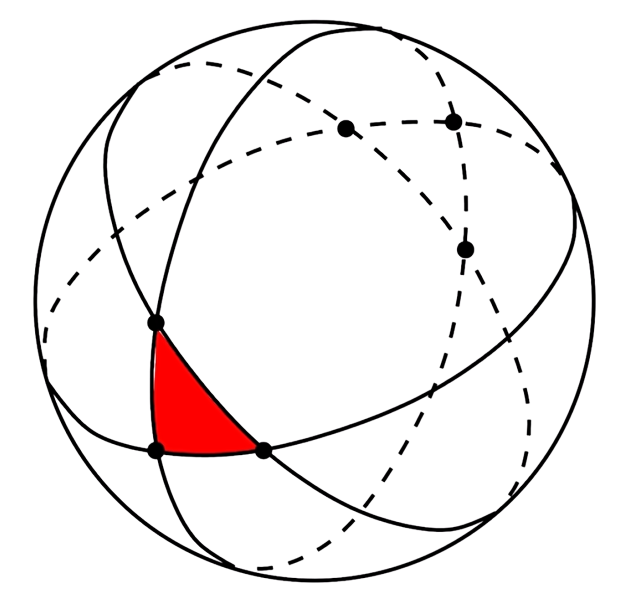
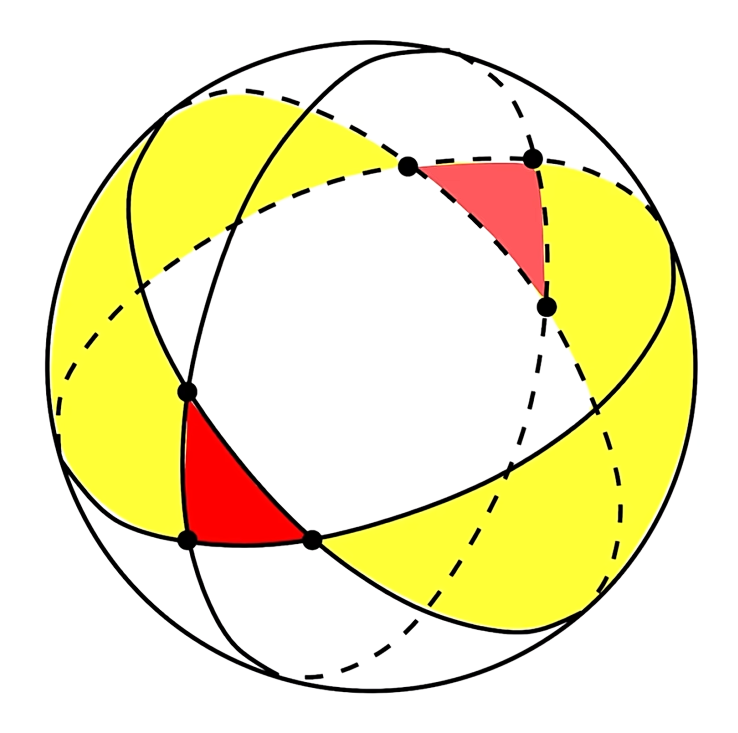
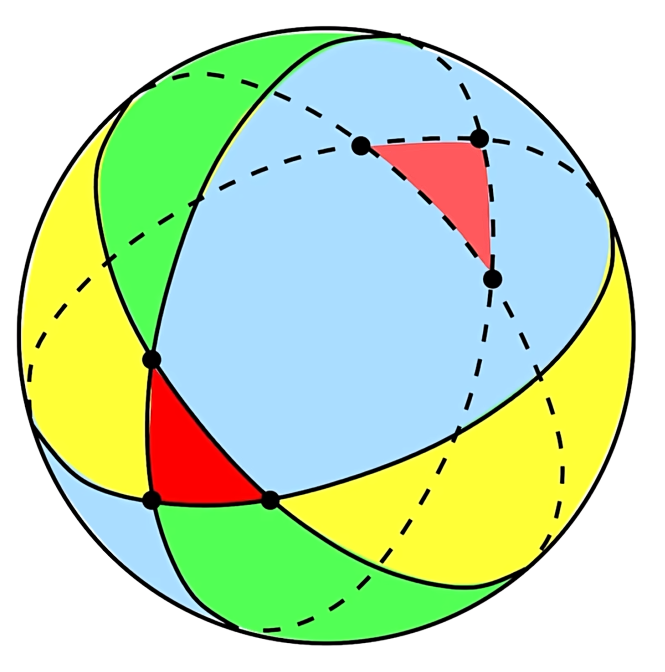

# 多面体欧拉公式

$\textbf{定理 1.(欧拉公式)}$ 对简单多面体(指与单位球面同胚的多面体)，有 $V - E + F = 2$，其中 $V$ 为 点数，$E$ 为边数，$F$ 为面数.

$\textbf{引理.(球面三角形面积公式)}$ 平面 $\Sigma_1, \Sigma_2, \Sigma_3$ 过单位球球心(如下左图)，它们两两之间的夹角为 $\alpha, \beta, \gamma$，则它们截球面形成的球面三角形面积为 $\alpha + \beta + \gamma - \pi$. 

$\text{证明}.$ 记球面三角形面积为 $S$. 蓝、黄、绿色区域均包含红色区域. 观察下左图，容易看出，

$$
\begin{align*}
    4\pi = S_{球} &= S_蓝 + S_黄 + S_绿 - 4S\\
    &= 4\pi (\dfrac{2\alpha}{2\pi} + \dfrac{2\beta}{2\pi} + \dfrac{2\gamma}{2\pi}) - 4S
\end{align*}
$$

化简即证.

再来证明欧拉公式. 首先,球面 $n$ 边形可以拆成 $n - 2$ 个球面三角形，不难得出 $S_n = 内角和 - (n - 2)\pi$. 

把多面体的每条棱都(通过其与单位球面的同胚映射)投影到单位球面上——可以简单理解成往中间放一光源，光源作为球心，把多面体投影到球面上——这样就构成了 $F$ 个球面多边形，对它们的面积求和有，

$$
\begin{align*}
    4\pi = \sum S_i &= \sum 内角和 - \pi\sum E_i + 2\pi F\\
    &= 2\pi V - 2\pi E + 2\pi F
\end{align*}
$$

其中 $E_i$ 为每个多边形的边数. 化简即证. 

## 参考

[欧拉公式(多面体)之来自天才的证明](https://www.bilibili.com/video/BV1em4y1g7ds/?spm_id_from=333.1387.favlist.content.click&vd_source=87cb0541bdd5704fb2a4dc0d45f77d71)