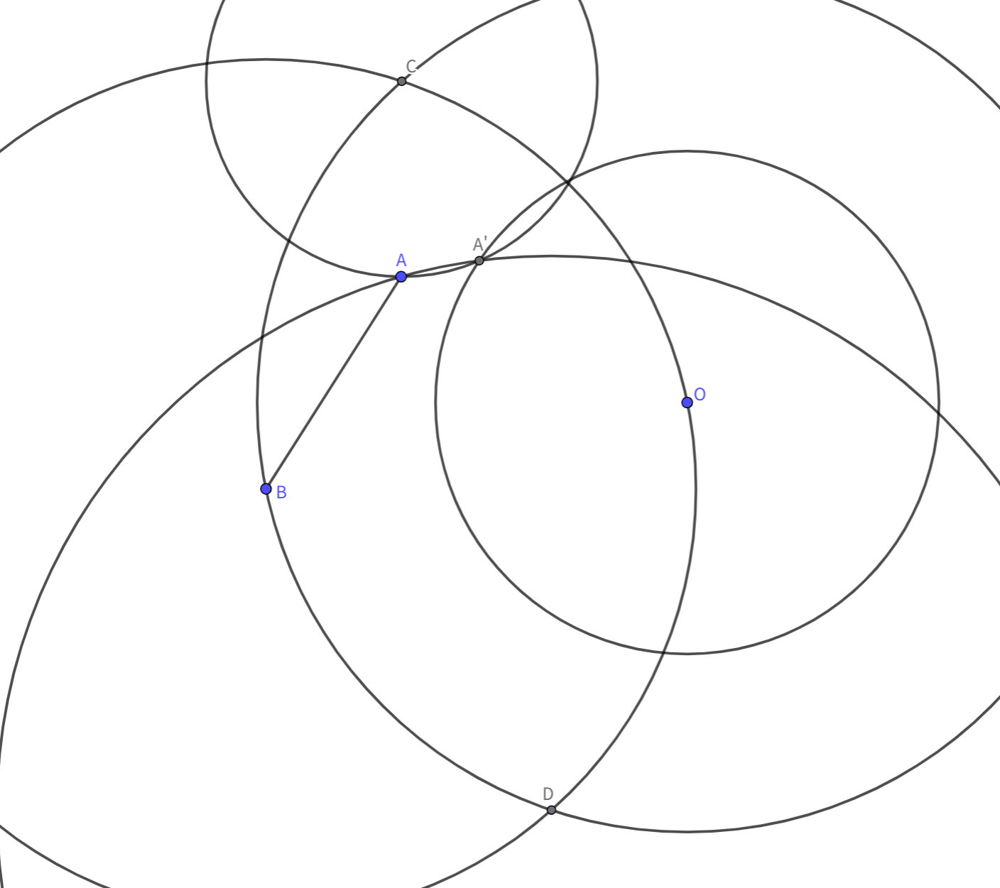
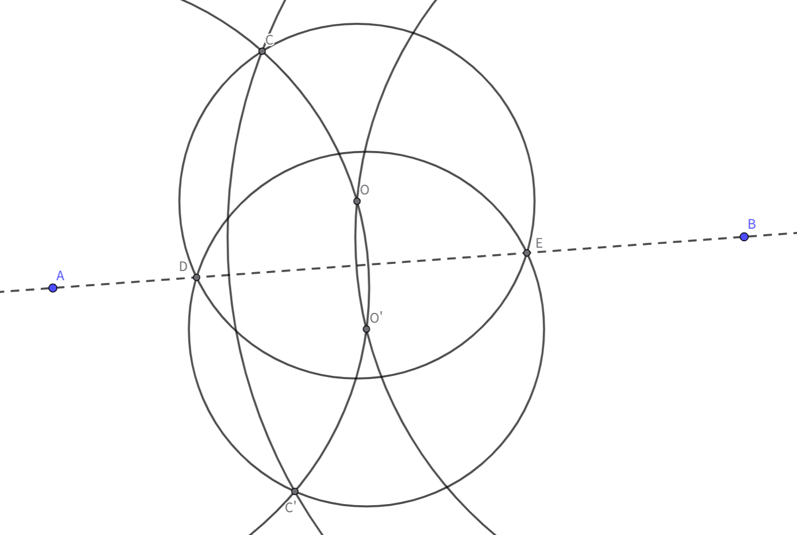
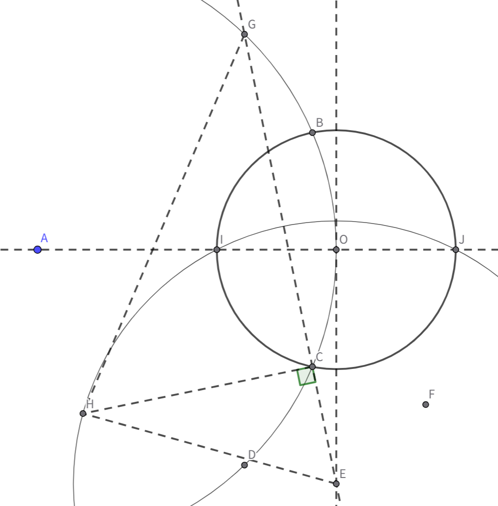
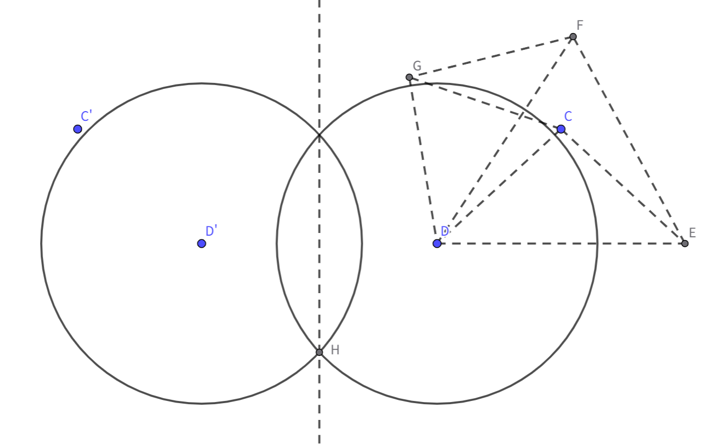

## 结论[^1]

1. 松圆规 $\Leftrightarrow$ 紧圆规

2. 单规作图 $\Leftrightarrow$ 尺规作图 $>$ 单尺作图

## 记号
$O(A)$: 表示过点 $A$ 的 $\odot O$
$O(AB)$: 表示以 $AB$ 为半径的 $\odot O$

松规：只能使用上述第一种作圆方法的圆规
紧规：上述两种方法均可使用的圆规

## 证明

要证松规和紧规等价，只要证松规能作 $O(AB)$ 即可

$\textbf{Theorem 1.}$ 给定点 $O, A, B$, 用松规可作 $O(AB)$.

作 $B(O), O(B)$，交于 $C, D$，此时 $CD$ 为 $BO$ 中垂线
作 $C(A), D(A)$，交于 $A'$，$A, A'$ 关于 $CD$ 对称
$O(A')$ 即为所求. 

要证单规和尺规作图等价，只要用单规完成以下两件事：
1. 已知 $A, B$ 两点和 $\odot O$，作出 $AB$ 与 $\odot O$ 的两个交点
2. 已知 $A, B, C, D$ 四点，作出 $AB$ 与 $CD$ 的交点

$\textbf{Theorem 2.}$ 给定点 $A, B$ 和 $\odot O$，$O \notin AB$，单规可作 $AB$ 与 $\odot O$ 的两个交点.

作 $A(O), B(O)$，交于 $O'$，则 $O, O'$ 关于 $AB$ 对称

记 $A(O), \odot O$ 交于 $C$
作 $B(C)$，交 $A(O)$ 于 $C'$, 则 $C, C'$ 关于 $AB$ 对称
作 $O'(C')$，交 $\odot O$ 于 $D, E$，即为所求

$\textbf{Theorem 3.}$[^2] 给定点 $A$ 和 $\odot O$，单规可作 $AO$ 与 $\odot O$ 的两个交点.

作 $A(O)$，交 $\odot O$ 于 $B, C$
作 $C(O)$，交 $A(O)$ 于 $D$
作 $O(D)$，交 $C(D)$ 于 $E$，交 $A(O)$ 于 $D, G$

此时 $OB = OC = CE, BC = OD = OE$，四边形 $BCEO$ 为平行四边形.
于是 $CE \parallel BO \parallel CG$，故 $E, C, G$ 三点共线

记 $\odot O$ 半径为 $a$, $BC$ 长为 $b$, $CG$ 长为 $c$，
则可以证明 $b^2 = a^2 + ac$
由于 $OE \parallel BC \perp AO$，只要作出 $E(a^2 + b^2)$ 即可

作 $E(C)$，交 $C(O)$ 于 $F$
注意到 $\angle CEF = 60 \degree$，$GF^2 = a^2 + ac + c^2 = b^2 + c^2$

作 $G(F), C(B)$，交于 $H$
此时$GH^2 = GF^2 = b^2 + c^2 = CH^2 + CG^2$，故 $CH \perp EG$.

作 $E(H)$，交 $\odot O$ 于 $I, J$，即为所求

$\textbf{Theorem 4.}$ 给定点 $A, B, C, D$，单规可作 $AB$ 与 $CD$ 的交点.

由于写出每一步的圆会使图形过于复杂，这里只写出大致的思路与关键步骤的作法.

以 $AB$ 为对称轴，取 $C, D$ 的对称点 $C', D'$
问题转化为求 $CD, C'D'$ 交点

作 $E$ 使四边形 $CC'D'E$ 为平行四边形
由于 $CE \parallel C'D'$，故只要构造 $\dfrac{DH}{DD'} = \dfrac{CE}{DE}$

作 $F$ 使得 $DF = DE, EF = DD'$
作 $G$ 使 $\triangle CDE \cong \triangle GDF$
此时我们有 $\triangle DEF \sim \triangle DCG$
于是 $\dfrac{CG}{EF} = \dfrac{CD}{DE}$
因此 $CG = DH = D'H$

作 $D(CG)$ 和 $D'(CG)$ 即得 $H$.

## 参考

[^1]: [依旧有灵魂的尺规作图](https://zhuanlan.zhihu.com/p/110861499)
[^2]: [【Euclidea】Omicron篇 攻略 & 部分证明](https://zhuanlan.zhihu.com/p/567253502)