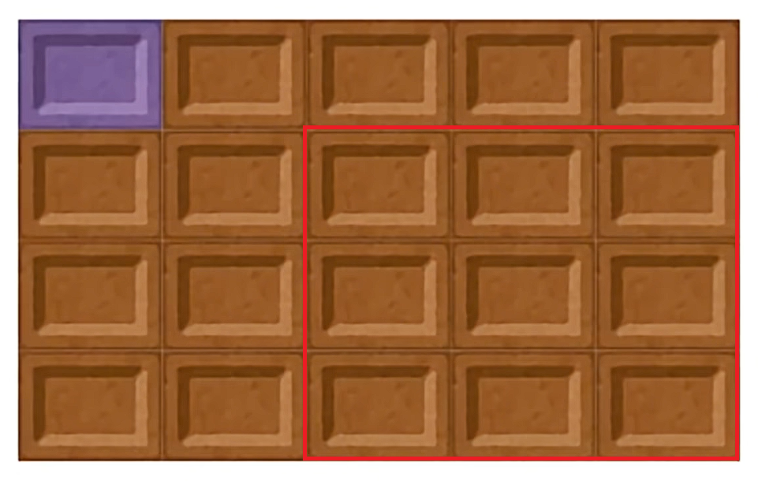

$\textbf{命题 1.}$ 无理数的无理数次方可能是有理数.

$\textbf{证.}$ 考虑 $\sqrt 2 ^ {\sqrt 2}$，若其为有理数，命题得证；若其为无理数，则 $\left(\sqrt 2 ^ {\sqrt 2}\right) ^ {\sqrt 2} = \sqrt 2 ^ 2 = 2$ 为有理数，命题也得证.

$\textbf{命题 2.}$[^1] 有一个 $n \times m$ 的巧克力块($n, m$ 不全为 $1$)，其中位于左上角的那一块是有毒的(如图所示). 现在 $Alice$ 和 $Bob$ 正在玩一个游戏，$Alice$ 先手. 每一轮，玩家可以选择一块巧克力，把它以及它右下方的所有巧克力拿走吃掉，每一轮至少要拿走一块巧克力. 拿到有毒巧克力的玩家就输了. 在双方都使用最优策略的情况下，先手必胜.

例：如图所示，当 $n = 4, m = 5$ 时，选择第 $2$ 行第 $3$ 列的巧克力，那么就相当于拿走红框中的 $9$ 块巧克力.

$\textbf{证.}$ 考虑只取走右下角一块巧克力的局面，记为 $P$. 若 $P$ 为必败态，则初始局面先手必胜；若 $P$ 为必胜态，则必存在 $P$ 能达到的必败局面 $Q$. 注意到初始状态一定也能达到 $Q$，因此初始局面先手必胜. 命题得证. 

同理可证明 $n$ 维巧克力有限的情况. 

btw，$2$ 维无穷多巧克力的情况($\mathbb N^2$)可以给出一个构造性证明(具体见参考)，$3$ 维的无穷多巧克力的情况($\mathbb N^3$)目前仍是 open problem. 

## 参考

[^1]: [非构造性证明，如何在毒巧克力游戏中活下来](https://www.bilibili.com/video/BV1QCFYzwEKS/?spm_id_from=333.1007.0.0&vd_source=87cb0541bdd5704fb2a4dc0d45f77d71)