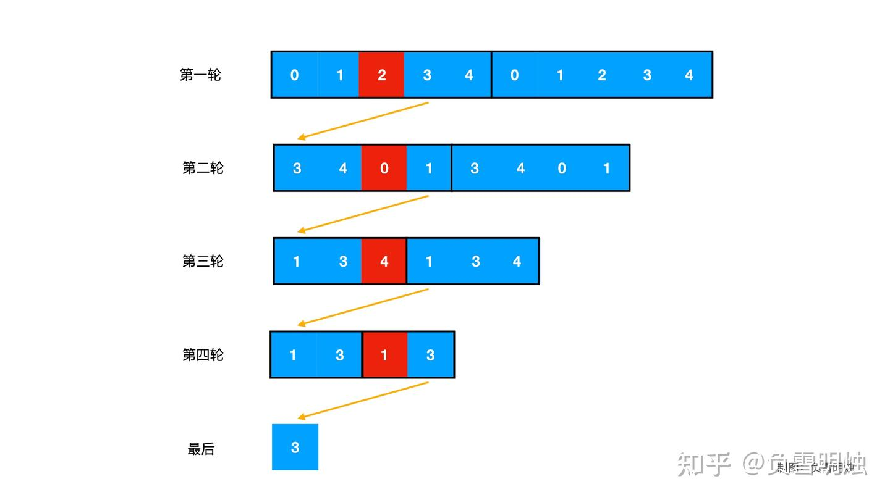

# 约瑟夫环问题

## 问题

$0, 1, 2, \cdots, n - 1$ 这 $n$ 个人围成一个圆，从 $0$ 号开始报数(报数从 $0$ 开始)，报到 $m - 1$ 的人淘汰，之后从下一个人开始报数. 求最后剩下的人是谁. 

例如，下图为 $n = 5, m = 3$ 时的情况，红色为淘汰的人.

反向考虑，最后一轮结束后，最终只剩下一个人(下称他)，我们考虑他的在前面每一轮中的下标，即他应该报的数是多少.

最后一轮中，他活下来了，并且他一定是淘汰者的的下一位，也就是报出 $m - 1$ 的下一位，所以他报的数一定是 $m$. 由于站成圆，所以他的下标是 $m \mod 2$.

最后一轮中报 $0$ 的人，一定是倒数第二轮中淘汰者的下一位，所以他报的数就是 $m + m \mod 2$. 由于站成圆，所以他的下标是 $(m + m \mod 2) \mod 3$.

以此类推，我们有 $f(n, m) = (m + f(n - 1, m)) \mod n$.

## 参考

[这或许是你能找到的最详细约瑟夫环数学推导！](https://zhuanlan.zhihu.com/p/121159246)